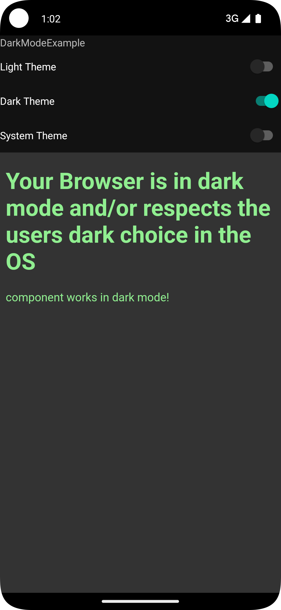

## About this app

Simple example app to experiment with dark mode theme in app vs system setting including
`WebView` using `@media (prefers-color-scheme: dark)` selector.



## Dark mode using Material design

Info available from https://m2.material.io/develop/android/theming/dark

Added dependency for material starting from a simple example project
```
implementation("com.google.android.material:material:1.10.0")
```

Then changed app theme to extend from a DayNight version. See later for using a Light theme how you
can still force dark mode manually. 
```
Theme.MaterialComponents.DayNight
```

## Using a Webview

Added permission to manifest so app gets internet connection.

```
<uses-permission android:name="android.permission.INTERNET" />
```

In xml layout added a `WebView` and loaded an example URL (see webapp folder for example HTML).

## Support vs Force Dark mode

Info on how to support dark mode can be found on link below. Comes down to having a `DayNight` theme.
https://developer.android.com/develop/ui/views/theming/darktheme#support-dark-theme

```
<style name="AppTheme" parent="Theme.MaterialComponents.DayNight">
```

Letting the user switch theme can be done (without having to restart the app) by simply calling the
right version, see link: 
https://developer.android.com/develop/ui/views/theming/darktheme#change-themes

```
    @RequiresApi(Build.VERSION_CODES.S)
    private fun forceModeNew(mode: DarkMode) {
        val uiManager = getSystemService(UI_MODE_SERVICE) as UiModeManager
        when (mode) {
            DarkMode.LIGHT -> uiManager.setApplicationNightMode(UiModeManager.MODE_NIGHT_NO)
            DarkMode.DARK -> uiManager.setApplicationNightMode(UiModeManager.MODE_NIGHT_YES)
            DarkMode.SYSTEM -> uiManager.setApplicationNightMode(UiModeManager.MODE_NIGHT_AUTO)
        }
    }
```

For older API levels there is code in the project also, it uses `AppCompatDelegate.setDefaultNightMode`
instead of `UiModeManager`. Also the `DarkMode` enum I've create in this app is completely 
optional and only added to manage difference between both API levels. 

Info on how to force dark mode if you don't want to extend from a `DayNight` theme:
https://developer.android.com/develop/ui/views/theming/darktheme#force-dark

TODO: create a branch with that example also

Specific web content info:
https://developer.android.com/develop/ui/views/theming/darktheme#web-content

## WebApp Content

Contents of `webapp` folder is an angular example project showing how darkmode can be implemented
for the web. Firebase hosting is used to also publish it at:

https://darkmode-example.web.app

If you make changes you could always update the app or host it locally using `ng serve`. Note that
an android emulator refers to `10.0.2.2` as the localhost so it would be available at `10.0.2.2:4200` 
by default.

Publishing to hosting can be done with (needs your `firebase init` setup to work):

```
`ng build --aot`

`firebase deploy -m "commit message" --only hosting`

```